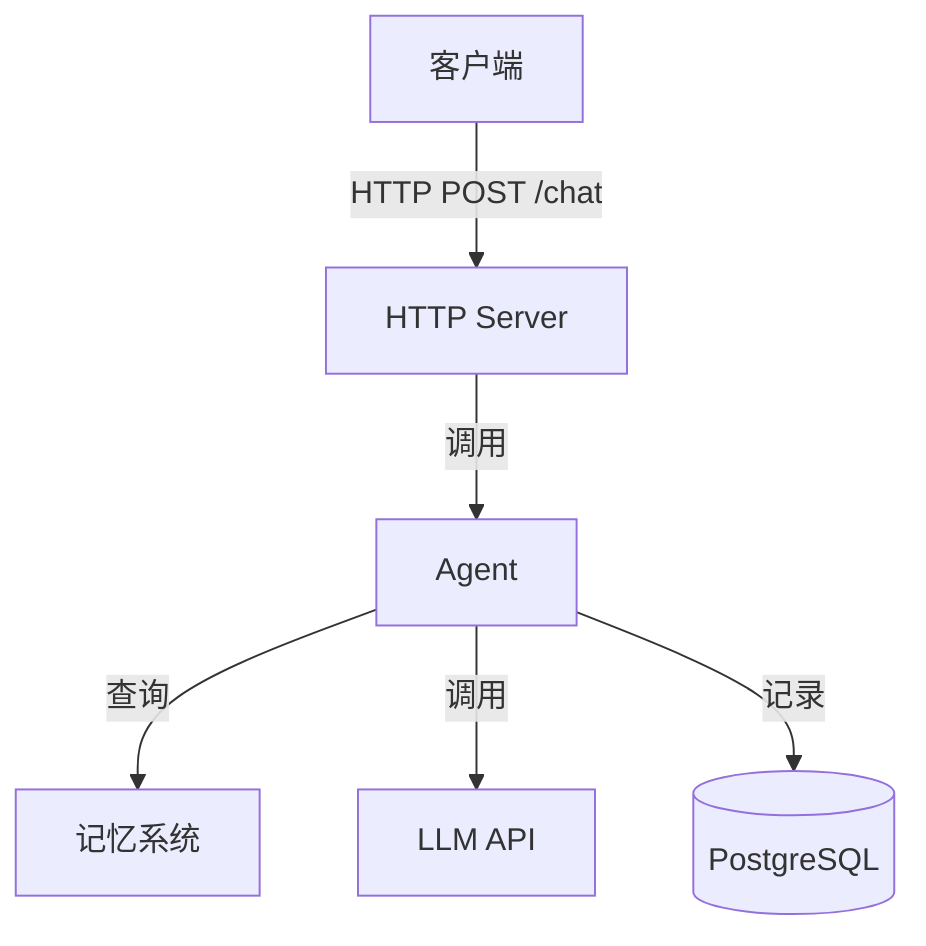

# NuClaw C++ 版优化方案

**前提：** 坚持 C++，提升代码完整度和实用性

---

## 核心问题（C++ 版）

| 问题 | 现状 | 目标 |
|:---|:---|:---|
| HTTP 服务缺失 | 只有概念，无真实服务器 | 用 Boost.Beast 实现完整 REST API |
| LLM 调用 Mock | 伪代码/简化实现 | 接入真实 OpenAI/Moonshot HTTP API |
| 数据库 Mock | 内存数据结构 | 接入真实 PostgreSQL (libpq) |
| 无法一键运行 | 代码片段 | 完整可编译、可运行的服务 |
| 缺少测试 | 无测试章节 | 添加 Google Test 单元测试 |

---

## 具体优化措施

### 1. 补充真实 HTTP 服务（Step 12 新增）

**新增文件：** `include/nuclaw/http_server.hpp`

```cpp
// 基于 Boost.Beast 的 REST API 服务器
class HttpServer {
public:
    HttpServer(boost::asio::io_context& io, unsigned short port);
    
    // 注册路由
    void post(const std::string& path, Handler handler);
    void get(const std::string& path, Handler handler);
    
    // 启动/停止
    void start();
    void stop();
    
private:
    boost::asio::io_context& io_;
    tcp::acceptor acceptor_;
    std::map<std::string, Handler> routes_;
};

// 使用示例
HttpServer server(io, 8080);
server.post("/chat", [](const json::value& req) -> json::value {
    auto message = req.at("message").as_string();
    auto response = agent->handle(message);
    return json::object({{"reply", response}});
});
server.start();
```

**依赖：** Boost.Beast (header-only)

### 2. 接入真实 LLM API（Step 2 改进）

**新增文件：** `include/nuclaw/llm_client.hpp`

```cpp
// 真实的 HTTP LLM 客户端
class LLMClient {
public:
    struct Config {
        std::string provider;  // "openai", "moonshot", "anthropic"
        std::string api_key;
        std::string model = "gpt-3.5-turbo";
        std::string base_url;
    };
    
    LLMClient(boost::asio::io_context& io, const Config& config);
    
    // 同步调用（简化版）
    std::string complete(const std::string& prompt);
    
    // 异步调用（生产版）
    void complete_async(const std::string& prompt, 
                        std::function<void(std::string)> callback);
    
private:
    // HTTP 请求实现
    json::value request(const std::string& endpoint, 
                        const json::value& body);
};
```

**环境变量读取：**
```cpp
LLMClient::Config config;
config.provider = std::getenv("LLM_PROVIDER") ?: "openai";
config.api_key = std::getenv("OPENAI_API_KEY");
```

### 3. 接入 PostgreSQL（Step 8 改进）

**新增文件：** `include/nuclaw/database.hpp`

```cpp
// PostgreSQL 连接池
class Database {
public:
    struct Config {
        std::string host = "localhost";
        int port = 5432;
        std::string database;
        std::string user;
        std::string password;
    };
    
    Database(const Config& config);
    
    // 执行查询
    pqxx::result query(const std::string& sql);
    
    // 执行更新
    void execute(const std::string& sql);
    
    // 预编译语句
    template<typename... Args>
    pqxx::result prepared(const std::string& name, Args... args);
};
```

**依赖：** libpqxx

### 4. 重构章节结构

```
Step 1-5: 保持现状（概念建立）

Step 6: 会话管理 + 真实 HTTP 服务器（合并原 Step 6-7）
  - Boost.Beast 基础
  - REST API 设计
  - 路由注册

Step 7: 真实 LLM 调用（替换原 Step 2 的 Mock）
  - HTTP 客户端实现
  - 接入 OpenAI API
  - 错误处理和重试

Step 8: 真实数据库（替换内存存储）
  - PostgreSQL 基础
  - 连接池
  - ORM 简化实现

Step 9: 配置管理（改进）
  - 环境变量读取
  - 配置文件 (JSON/YAML)
  - 热更新

Step 10: 测试策略（新增）⭐
  - Google Test 基础
  - 单元测试
  - 集成测试
  - Mock 服务器

Step 11-14: 产品化（精简）
  - 合并分散章节
  - 强化与实战的衔接

Step 15-20: 保持现状（实战项目）
```

### 5. 每章代码完整度标准

**每个 Step 必须：**

```bash
src/stepXX/
├── CMakeLists.txt          # 完整可编译
├── include/
│   └── nuclaw/
│       └── ...             # 头文件
├── src/
│   ├── main.cpp            # 可运行入口
│   └── ...                 # 实现文件
└── tests/
    ├── CMakeLists.txt      # 测试配置
    └── test_*.cpp          # 单元测试
```

**验证脚本：**
```bash
#!/bin/bash
# verify.sh - 每章验证脚本

cd src/stepXX
mkdir -p build && cd build
cmake ..
make -j

# 运行测试
./tests/stepXX_tests

# 运行主程序
./stepXX_demo &
PID=$!
sleep 2

# 测试 API
curl -X POST http://localhost:8080/chat \
  -H "Content-Type: application/json" \
  -d '{"message":"hello"}'

kill $PID
```

### 6. Docker 环境完善

**Dockerfile 优化：**
```dockerfile
# 多阶段构建，包含所有依赖
FROM ubuntu:22.04 AS builder

RUN apt-get update && apt-get install -y \
    build-essential cmake \
    libboost-all-dev \
    libpq-dev \
    nlohmann-json3-dev

WORKDIR /build
COPY . .
RUN mkdir build && cd build && \
    cmake .. -DCMAKE_BUILD_TYPE=Release && \
    make -j$(nproc)

# 运行阶段
FROM ubuntu:22.04
RUN apt-get update && apt-get install -y \
    libboost-system1.74.0 \
    libboost-thread1.74.0 \
    libboost-json1.74.0 \
    libpq5

COPY --from=builder /build/build/stepXX_demo /app/
WORKDIR /app
EXPOSE 8080
CMD ["./stepXX_demo"]
```

**docker-compose.yml：**
```yaml
version: '3.8'
services:
  stepXX:
    build: .
    ports:
      - "8080:8080"
    environment:
      - OPENAI_API_KEY=${OPENAI_API_KEY}
      - DATABASE_URL=postgresql://postgres:postgres@db:5432/nuclaw
    depends_on:
      - db
      
  db:
    image: postgres:15
    environment:
      POSTGRES_PASSWORD: postgres
    volumes:
      - postgres-data:/var/lib/postgresql/data
      
volumes:
  postgres-data:
```

### 7. 架构图补充

**每章必须包含：**

1. **系统架构图**（Excalidraw 风格）
2. **数据流图**（Mermaid）
3. **类图**（关键类关系）

**示例：**
```markdown
## 架构图



```

### 8. CI/CD 配置

**.github/workflows/build.yml：**
```yaml
name: Build and Test
on: [push, pull_request]

jobs:
  build:
    runs-on: ubuntu-latest
    strategy:
      matrix:
        step: [1, 2, 3, 4, 5, 6, 7, 8, 9, 10, 11, 12, 13, 14, 15, 16, 17, 18, 19, 20]
    
    steps:
    - uses: actions/checkout@v3
    
    - name: Install dependencies
      run: |
        sudo apt-get update
        sudo apt-get install -y libboost-all-dev libpq-dev
    
    - name: Build Step ${{ matrix.step }}
      run: |
        cd src/step${{ matrix.step }}
        mkdir build && cd build
        cmake ..
        make -j
    
    - name: Test Step ${{ matrix.step }}
      run: |
        cd src/step${{ matrix.step }}/build
        ctest --output-on-failure
```

---

## 执行计划

### 第一阶段：基础设施（2 周）

1. **Week 1:** 
   - 创建 `http_server.hpp`（Boost.Beast 封装）
   - 创建 `llm_client.hpp`（HTTP 客户端）
   - 创建 `database.hpp`（PostgreSQL 封装）

2. **Week 2:**
   - 重写 Step 6（HTTP 服务）
   - 重写 Step 7（真实 LLM）
   - 重写 Step 8（真实数据库）
   - 添加 Step 10（测试）

### 第二阶段：验证完善（1 周）

3. **Week 3:**
   - 编写 `verify.sh` 验证脚本
   - 确保每章可编译、可运行、可测试
   - 完善 Docker 配置

### 第三阶段：视觉优化（1 周）

4. **Week 4:**
   - 绘制架构图（Excalidraw）
   - 补充 Mermaid 流程图
   - 统一文档格式

---

## 关键决策

| 决策 | 方案 | 理由 |
|:---|:---|:---|
| HTTP 库 | Boost.Beast | Header-only，C++ 标准，无需额外依赖 |
| JSON 库 | Boost.JSON / nlohmann/json | Boost.JSON 与 Beast 配合更好 |
| DB 库 | libpqxx | PostgreSQL 官方 C++ 客户端 |
| 测试框架 | Google Test | 行业标准，CMake 集成好 |
| HTTP 客户端 | Boost.Beast | 与服务器统一，减少依赖 |
| 构建工具 | CMake | 行业标准，跨平台 |

---

## 预期成果

优化后，学习者可以：

```bash
# 1. 一键编译运行
cd src/step20
mkdir build && cd build
cmake .. && make -j
./step20_demo

# 2. 真实 API 调用
curl http://localhost:8080/chat \
  -d '{"message":"你好"}'
# 返回真实 LLM 生成的回复

# 3. 数据持久化
# 对话记录自动存入 PostgreSQL

# 4. 运行测试
ctest
# 所有测试通过

# 5. Docker 部署
docker-compose up
# 完整 SaaS 平台启动
```

---

**核心原则：** C++ 可以，但必须**完整、可运行、有实用价值**。
