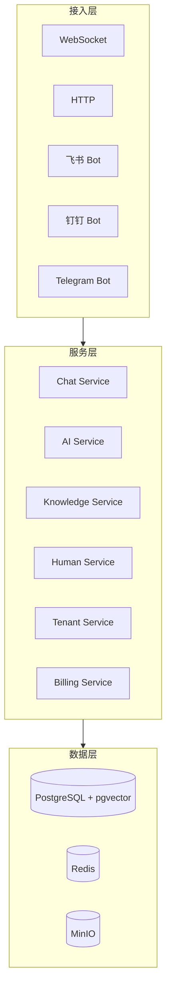

# NuClaw

> 用 C++17 从零构建 AI Agent —— 渐进式教程

[](https://isocpp.org/std/the-standard)
[](https://cmake.org/)
[](LICENSE)

## 🎯 项目简介

NuClaw 是一个**渐进式 C++ AI Agent 教程项目**。

**核心特点：**
- 📈 **代码演进**：每章基于前一章，`git diff` 可见变化
- 🎯 **问题驱动**：每章解决前一章的实际问题
- 📚 **循序渐进**：从 89 行单文件到 1500+ 行完整项目

## 🚀 快速开始

```bash
git clone https://github.com/chapin666/NuClaw.git
cd NuClaw

# Step 0: 最简单的 Echo 服务器
cd src/step00
g++ -std=c++17 main.cpp -o server -lboost_system -lpthread
./server

# 测试
curl http://localhost:8080/hello
```

## 📖 教程大纲

### Part 1: 基础构建（Step 0-5）

| Step | 主题 | 核心概念 | 代码量 |
|:---:|:---|:---|:---:|
| **0** | [Echo 服务器](tutorials/step00/tutorial.md) | Boost.Asio, 同步 TCP | 89行 |
| **1** | [异步 I/O](tutorials/step01/tutorial.md) | Session, async_read/write | 184行 |
| **2** | [HTTP 协议](tutorials/step02/tutorial.md) | HTTP 解析, Router, 进阶技巧 | 350行 |
| **3** | [规则 AI](tutorials/step03/tutorial.md) | Agent Loop, 正则匹配 | 350行 |
| **4** | [多轮对话](tutorials/step04/tutorial.md) | Session, 上下文管理 | 400行 |
| **5** | [LLM 接入](tutorials/step05/tutorial.md) | API 调用, Prompt 工程 | 450行 |

**学习重点：** C++ 网络编程 → Agent Loop 设计 → LLM 集成

**阶段目标：** 让 Agent 能跑起来，能对话

---

### Part 2: 能力扩展（Step 6-12）

| Step | 主题 | 核心概念 | 代码量 | 状态 |
|:---:|:---|:---|:---:|:---:|
| **6** | [工具调用](tutorials/step06/tutorial.md) | 工具接口, 硬编码执行 | 550行 | ✅ 完成 |
| **7** | [异步工具](tutorials/step07/tutorial.md) | 并发控制, 超时机制 | 600行 | ✅ 完成 |
| **8** | [安全沙箱](tutorials/step08/tutorial.md) | SSRF/路径防护, 审计 | 700行 | ✅ 完成 |
| **9** | [工具与技能系统](tutorials/step09/tutorial.md) | 注册表模式, Skill 封装 | ~750行 | ✅ 完成 |
| **10** | [RAG 检索](tutorials/step10/tutorial.md) | 向量数据库, Embedding | ~800行 | ✅ 完成 |
| **11** | [多 Agent 协作](tutorials/step11/tutorial.md) | Agent 通信, 任务分发 | ~850行 | ✅ 完成 |
| **12** | [MCP 协议接入](tutorials/step12/tutorial.md) | Model Context Protocol, 工具生态 | ~900行 | ✅ 完成 |

**学习重点：** 工具系统 → 安全防护 → 注册表模式 → RAG 检索 → 多 Agent 协作 → MCP 生态

**阶段目标：** 让 Agent 能做更多事，更聪明

---

### Part 3: 产品化（Step 13-17）

| Step | 主题 | 核心概念 | 代码量 | 状态 |
|:---:|:---|:---|:---:|:---:|
| **13** | [配置管理](tutorials/step13/tutorial.md) | YAML/JSON 配置, 热加载 | ~950行 | ✅ 完成 |
| **14** | [监控告警](tutorials/step14/tutorial.md) | Metrics, Logging, Tracing | ~1000行 | ✅ 完成 |
| **15** | [部署运维](tutorials/step15/tutorial.md) | Docker, K8s, CI/CD | ~1100行 | ✅ 完成 |
| **16** | [IM 平台接入](tutorials/step16/tutorial.md) | 飞书/钉钉/企微/Telegram | ~1200行 | ✅ 完成 |
| **17** | [Agent 状态与记忆](tutorials/step17/tutorial.md) | 情感计算, 记忆系统 | ~1300行 | ✅ 完成 |

**学习重点：** 生产就绪（配置/监控/部署）→ 连接真实世界（IM）→ 赋予灵魂（状态/记忆）

**阶段目标：** 让 Agent 成为可上线的产品

---

### Part 4: 项目实战（Step 18-21）—— 智能客服 SaaS 平台

| Step | 主题 | 核心概念 | 代码量 | 状态 |
|:---:|:---|:---|:---:|:---:|
| **18** | [需求分析与架构设计](tutorials/step18/tutorial.md) | 需求分析、系统架构、技术选型 | ~2000行 | ✅ 完成 |
| **19** | [核心功能实现](tutorials/step19/tutorial.md) | Chat Service、AI Service、Knowledge Service | ~1500行 | ✅ 完成 |
| **20** | [高级功能实现](tutorials/step20/tutorial.md) | 人机协作、多租户、计费、Admin | ~1200行 | ✅ 完成 |
| **21** | [生产部署](tutorials/step21/tutorial.md) | Docker、K8s、监控、压测 | ~800行 | ✅ 完成 |

**项目：SmartSupport —— 智能客服 SaaS 平台**

一个基于前面所有章节知识构建的完整商业级 SaaS 产品：

```
核心价值：
• 7×24 小时 AI 自动回复，降低 80% 人工成本
• 多平台统一接入（网站/微信/飞书/钉钉）
• 人机协作，复杂问题无缝转人工
• 多租户隔离，数据安全有保障

技术架构：
├── Chat Service（WebSocket 会话管理）
├── AI Service（Agent + RAG + 工具调用）
├── Knowledge Service（向量检索）
├── Human Service（人工客服工作台）
├── Tenant Service（多租户隔离）
├── Billing Service（计费与套餐）
└── Admin Dashboard（运营管理）
```

---

## 🎨 项目实战展示

### 🏢 SmartSupport —— 智能客服 SaaS 平台

**生产级多租户智能客服平台**，综合运用 Step 0-17 全部技术栈。

**系统架构：**



**核心功能：**

| 功能模块 | 说明 | 对应章节 |
|:---|:---|:---:|
| **AI 自动回复** | RAG + LLM 智能回复，支持知识库检索 | Step 5, 10 |
| **人工客服** | 智能分配、客服工作台、会话接管 | Step 19 |
| **多租户** | 数据隔离、资源配额、成员管理 | Step 19 |
| **计费系统** | 套餐管理、用量统计、发票生成 | Step 19 |
| **IM 接入** | 飞书/钉钉/企微/Telegram 统一接入 | Step 15 |
| **监控告警** | Prometheus + Grafana 全链路监控 | Step 13 |

**技术亮点：**
- 多租户数据隔离（RLS + 租户上下文）
- WebSocket 实时通信 + 消息路由
- RAG 知识检索 + 置信度评估
- 人机协作智能分配算法
- K8s 微服务部署 + HPA 自动扩缩容

**业务场景：**

```mermaid
flowchart LR
    subgraph TenantA["租户 A（电商公司）"]
        A1["知识库：产品 FAQ"]
        A2["客服：小李、小王"]
        A3["接入：官网、微信"]
        A4["AI 自动回复 90% 问题"]
    end

    subgraph TenantB["租户 B（教育机构）"]
        B1["知识库：课程资料"]
        B2["教师：张老师"]
        B3["接入：官网、钉钉"]
    end

    subgraph Platform["平台运营方（你）"]
        P1["租户管理、套餐定价"]
        P2["计费结算、财务报表"]
        P3["系统监控、运维支持"]
    end

    TenantA -.-> Platform
    TenantB -.-> Platform

---

### 代码结构

```
# Step 0-5: 单文件（简单概念）
src/step0X/
├── main.cpp      (< 500行)
└── CMakeLists.txt

# Step 6-17: 模块化（复杂系统）
src/step0X/
├── main.cpp
├── chat_engine.hpp      # Agent 核心
├── llm_client.hpp       # LLM 调用
├── tool_executor.hpp    # 工具执行
├── *_tool.hpp           # 具体工具
├── config.hpp           # 配置管理 (Step 14+)
├── metrics.hpp          # 监控指标 (Step 14+)
└── ...

# Step 18-21: 微服务架构（SaaS 平台）
src/step0X/
├── CMakeLists.txt
├── include/
│   └── smartsupport/
│       ├── common/
│       │   ├── types.hpp
│       │   └── database.hpp
│       └── services/
│           ├── chat/
│           ├── ai/
│           ├── knowledge/
│           ├── human/       # Step 20+
│           ├── tenant/      # Step 20+
│           └── billing/     # Step 20+
├── src/
│   ├── main.cpp
│   ├── common/
│   └── services/
├── config/
├── k8s/                   # Step 21
└── tests/
```

---

## 🛠️ 编译

```bash
# 单文件章节 (0-5)
cd src/step03
g++ -std=c++17 main.cpp -o server -lboost_system -lpthread

# 模块化章节 (6-14)
cd src/step06
mkdir build && cd build
cmake .. && make
./nuclaw_step06

# 演示程序 (demos)
cd ../../..
mkdir build && cd build
cmake .. && make -j4
./step06_rest_demo
```

## 📊 当前状态

| 阶段 | 进度 | 代码行数 | 章节数 |
|:---|:---:|:---:|:---:|
| Part 1: 基础构建 | ✅ 完成 | 89-450 | 6 |
| Part 2: 能力扩展 | ✅ 完成 | 550-850 | 6 |
| Part 3: 产品化 | ✅ 完成 | 900-1300 | 6 |
| Part 4: 项目实战 | ✅ 完成 | 1500-2000 | 4 |
| **总计** | **✅ 全部完成** | **~80,000 字** | **21** |

---

## 🎉 学习路径总结

```mermaid
flowchart LR
    subgraph P1["Part 1: 基础构建"]
        P1_1[网络编程]
        P1_2[Agent Loop]
        P1_3[LLM 集成]
    end

    subgraph P2["Part 2: 能力扩展"]
        P2_1[工具系统]
        P2_2[安全防护]
        P2_3[RAG]
        P2_4[多 Agent 协作]
    end

    subgraph P3["Part 3: 产品化"]
        P3_1[MCP 协议]
        P3_2[配置管理]
        P3_3[监控告警]
        P3_4[容器化部署]
        P3_5[IM 接入]
        P3_6[状态记忆]
    end

    subgraph P4["Part 4: 项目实战"]
        P4_1[架构设计]
        P4_2[核心功能]
        P4_3[高级功能]
        P4_4[生产部署]
    end

    P1 --> P2 --> P3 --> P4
```



| 阶段 | 目标 |
|:---|:---|
| Part 1 (Step 0-5) | 让 Agent 能跑起来，能对话 |
| Part 2 (Step 6-11) | 让 Agent 能做更多事，更聪明 |
| Part 3 (Step 13-17) | 让 Agent 成为可上线的产品 |
| Part 4 (Step 18-21) | 综合运用，做出完整可商用的产品 |

**代码演进：**

```mermaid
gantt
    title 代码量演进
    dateFormat X
    axisFormat %s

    section 代码行数
    Step 0 : 0, 89
    Step 5 : 0, 450
    Step 11 : 0, 850
    Step 17 : 0, 1300
    Step 21 : 0, 2000
```



## 📄 许可证

MIT © NuClaw Authors

---

**设计理念**：不是堆砌功能，而是解决问题。每章都有明确的「前一章问题 → 本章解决 → 暴露新问题」循环。
