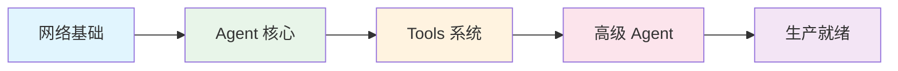

# NuClaw

> 用 C++17 从零构建 AI Agent —— 渐进式教程

[](https://isocpp.org/std/the-standard)
[](https://cmake.org/)
[](LICENSE)

## 这是什么？

**NuClaw** 是一个渐进式 C++ AI Agent 教程项目。

从 89 行单文件到 1000+ 行模块化系统，你将亲手构建一个完整的 AI Agent 框架，涵盖网络编程、异步架构、LLM 集成、工具系统、RAG 检索、多 Agent 协作等核心概念。

## 学习路径



| 阶段 | 章节 | 核心内容 | 代码量 |
|:---:|:---|:---|:---:|
| **Part 1** | Step 0-2 | 网络编程基础、异步 I/O、HTTP 协议 | 89-271 |
| **Part 2** | Step 3-5 | Agent Loop、WebSocket、LLM 接入 | 350-450 |
| **Part 3** | Step 6-8 | 工具调用、异步执行、安全沙箱 | 550-700 |
| **Part 4** | Step 9-11 | 注册表模式、RAG 检索、多 Agent 协作 | 750-850 |
| **Part 5** | Step 12-14 | 配置管理、监控告警、容器化部署 | 900-1000+ |

## 设计理念

!!! quote "不是堆砌功能，而是解决问题"

    每章都有明确的「前一章问题 → 本章解决 → 暴露新问题」循环。
    代码演进：单文件 → 模块化 → 配置化 → 容器化

## 快速开始

```bash
# 克隆项目
git clone https://github.com/chapin666/NuClaw.git
cd NuClaw

# Step 0: 最简单的 Echo 服务器
cd src/step00
g++ -std=c++17 main.cpp -o server -lboost_system -lpthread
./server

# 测试
curl http://localhost:8080/hello
```

## 项目特点

- :material-code-tags: **代码演进** — 每章基于前一章，`git diff` 可见变化
- :material-target: **问题驱动** — 每章解决前一章的实际问题
- :material-school: **循序渐进** — 从入门到生产级部署
- :material-book-open-page-variant: **详细教程** — 每个概念都有图解和示例

## 适用人群

- 想学习 C++ 网络编程的开发者
- 对 AI Agent 架构感兴趣的工程师
- 希望理解 LLM 应用底层实现的程序员
- 准备将 Agent 系统部署到生产环境的技术负责人

## 许可证

MIT © NuClaw Authors
